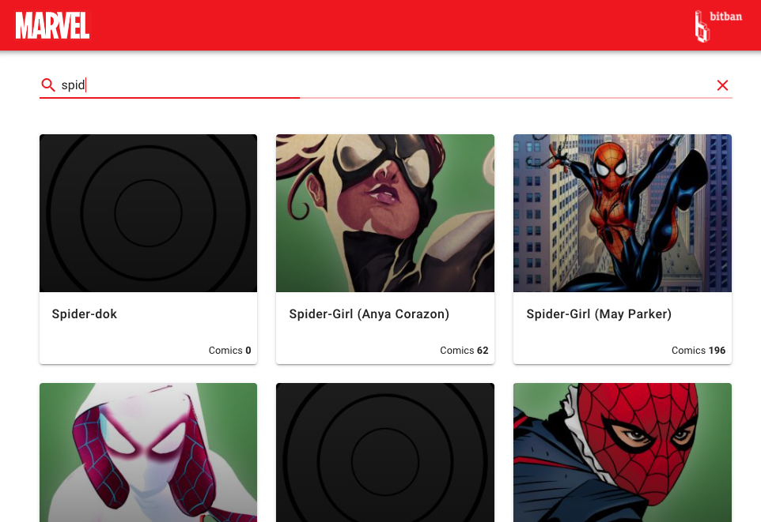

# Marvel character search

## Descripción
El objetivo de esta aplicación es poder listar información de personajes de marvel a partir de una búsqueda textual.
Para ello vamos a utilizar el [API oficial de Marvel](src/api/README.md)

Te hemos dejado preparado un pequeño esqueleto sobre el que puedes trabajar. 
El proyecto se ha inicializado utilizando la herramienta de [@vue/cli](https://cli.vuejs.org/) y hemos incluido Vuetify como librería de componentes UI

* Vue 2.X https://vuejs.org/
* Vuetify 2.X (Default install) https://vuetifyjs.com/en/

Eres completamente libre de modificar cualquier cosa de este proyecto, la mayoria de código existe para servirte de ejemplo y tener ya una base preparada, pero tienes total libertad para modificarlo y generar todos los componentes que creas convenientes.
Puedes utilizar las librerías que quieras (incluso no utilizar Vuetify para la UI, pero te lo recomendamos para ganar tiempo). El único requisíto es utilizar VueJS

El diseño tambien es completamente libre, se creativo y sorprendenos.

La prueba no debería llevarte más de un par de horas, pero tomate el tiempo que creas oportuno para dejar la app lo más pulida posible. Nos encanta la atención por el detalle y un buen UX

## Requisitos de la prueba
Para que la prueba sea válida debe cumplir al menos con los siguientes requisítos:

* Listar todos los personajes de marvel filtrados por el texto del usuario. Puedes elegir el formato que quieras para este listado o extender el ejemplo montado

  

* Cada personaje del listado debe mostrar al menos la siguiente información:
  * Nombre
  * Descripción
  * Imagen
  * Número de comics del personaje
  
* Vamos a poder consultar el detalle de cada personaje desde cada elemento del listado. Cada detalle de personaje debe mostrar al menos:
  * Nombre
  * URL a la pagina de detalle de Marvel Comics ej: http://marvel.com/comics/characters/1009664/thor?utm_campaign=apiRef&utm_source=efd167d210010cd64590885da9cb8473
  * Descripción
  * Imagen
  * Número de comics del personaje
  * Número de eventos en las que aparece el personaje
  * Número de stories en las que aparece el personaje
  * Listado de los últimos 4 comics del personaje
    * Titulo del comic
    * Imagen del comic 
* La app debe funcionar correctamente y sin errores de test `npm run test:unit` o lint `npm run lint`

## Comandos útiles
```
npm install
```

### Compiles and hot-reloads for development
```
npm run serve
```

### Compiles and minifies for production
```
npm run build
```

### Run your unit tests
```
npm run test:unit
```

### Lints and fixes files
```
npm run lint
```

### Customize configuration
See [Configuration Reference](https://cli.vuejs.org/config/).
